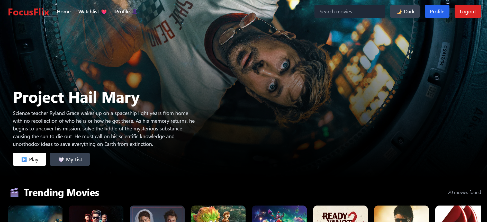
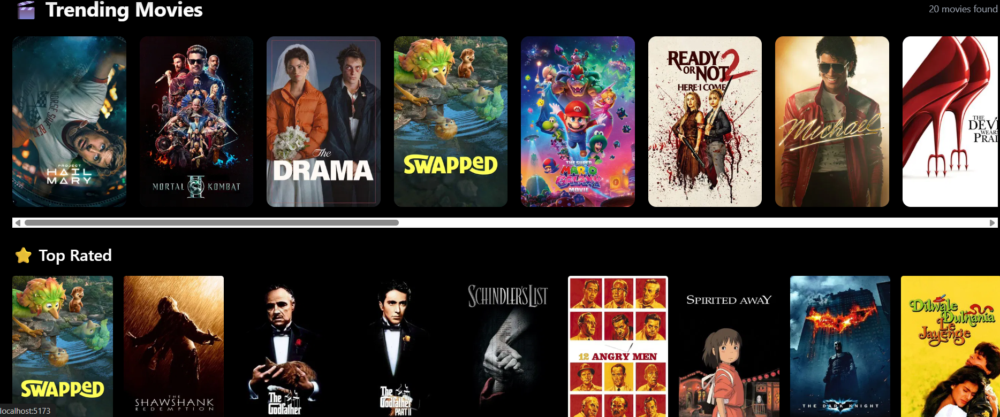
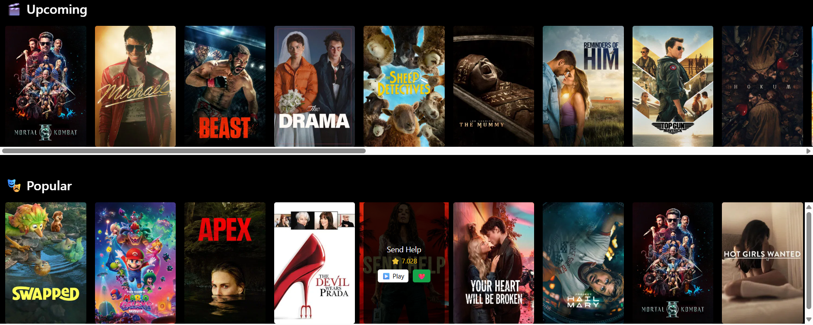
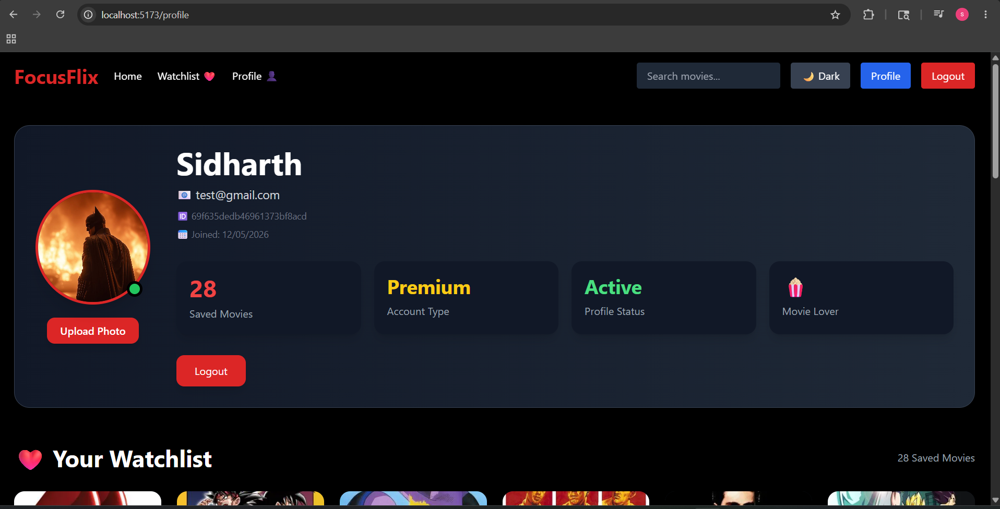
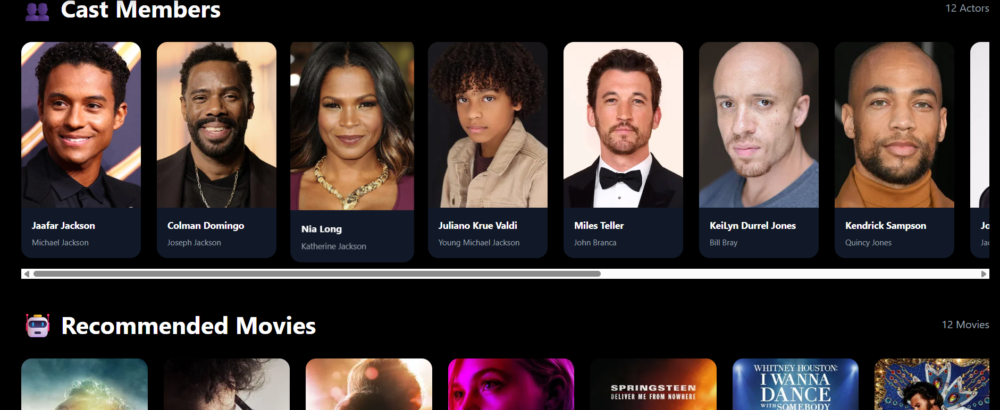
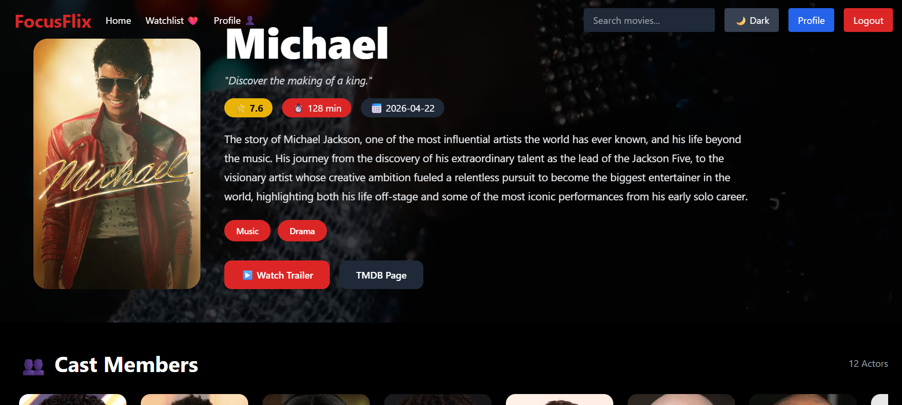
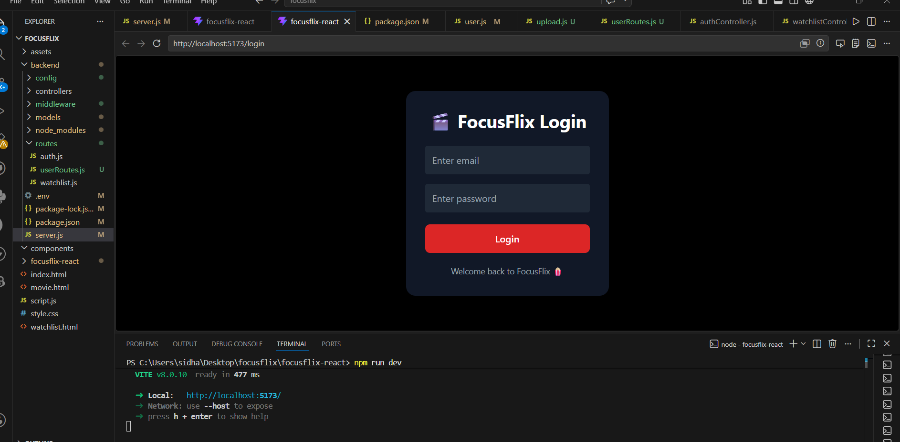
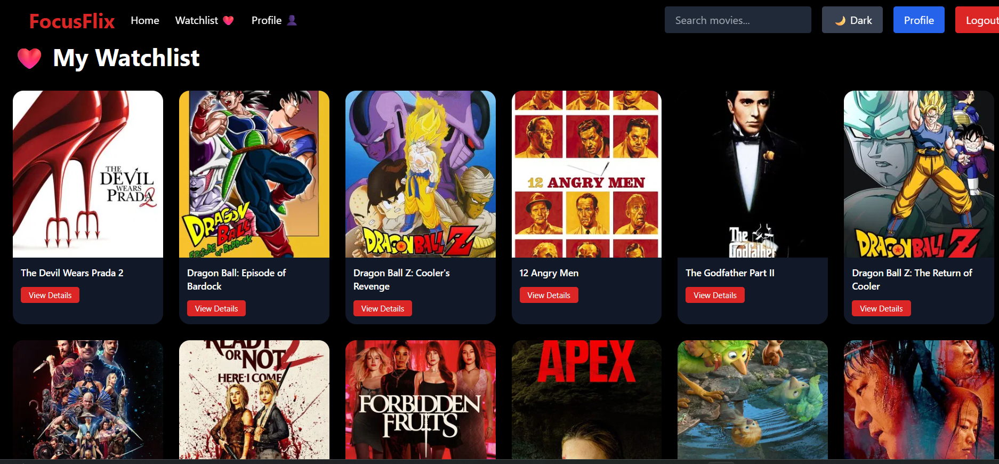

# 🎬 FocusFlix

FocusFlix is a modern movie streaming UI web application inspired by Netflix.

Built using React, Node.js, Express, MongoDB, and TMDB API.

---

# 🚀 Features

- 🔐 User Authentication (Login/Register)
- ❤️ Watchlist System
- 🎬 Movie Details Page
- ▶ YouTube Trailer Integration
- 👤 User Profile Page
- 🖼 Avatar Upload
- 🌗 Dark / Light Mode
- 🔍 Movie Search
- 🤖 Recommended Movies
- 📱 Responsive Design
- ⚡ Fast React + Vite Frontend

---

# 🛠 Tech Stack

## Frontend
- React
- Vite
- Tailwind CSS
- React Router

## Backend
- Node.js
- Express.js
- MongoDB
- JWT Authentication

## API
- TMDB API

---

# 📂 Folder Structure

```txt
focusflix/
 ├── backend/
 ├── src/
 ├── public/
 ├── package.json
```

---

# ⚙ Installation

## Clone Repository

```bash
git clone https://github.com/sqidharth3514/movie-streaming-app.git
```

## Frontend Setup

```bash
cd focusflix
npm install
npm run dev
```

## Backend Setup

```bash
cd backend
npm install
npm start
```

---

# 🔑 Environment Variables

Create `.env` file inside backend:

```env
MONGO_URI=YOUR_MONGODB_URL
JWT_SECRET=YOUR_SECRET
```

---

# 🌐 API Used

TMDB API

https://www.themoviedb.org/

---

# 📸 Screenshots

## Home Page




## Profile Page


## Movie Detail



## Login Page


## Watchlist


---

# 👨‍💻 Developer

Sidharth Dangwal

---

# ⭐ Future Improvements

- Firebase Auth
- Stripe Subscription
- AI Movie Recommendation
- Real Streaming Integration
- Admin Dashboard